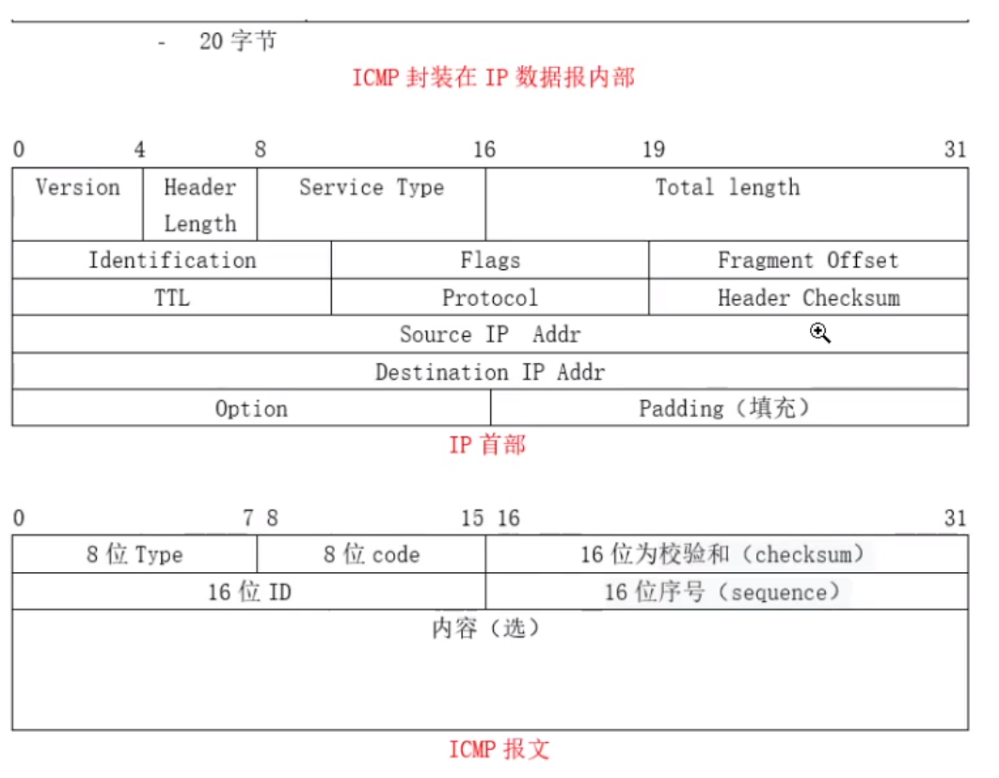
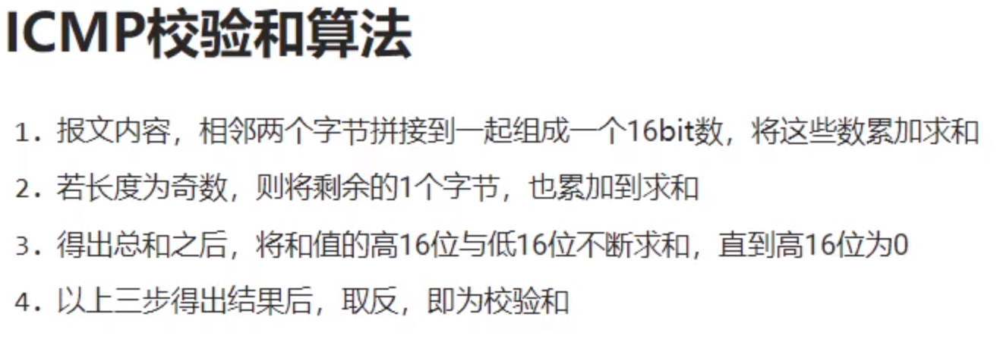

# 100行代码实现ping操作

# 参考资料

[ICMP_百度百科 (baidu.com)](https://baike.baidu.com/item/ICMP/572452)

# ICMP数据格式



# ICMP校验和算法


# 使用示例
## 只对一个IP地址进行ping操作
```shell
go run main.go -w 1000 -l 32 -n 4 www.baidu.com
```
## 对多个IP地址进行ping操作
请用英文逗号分隔多个IP地址
```shell
go run main.go -w 1000 -l 32 -n 4 www.baidu.com,www.qq.com
```